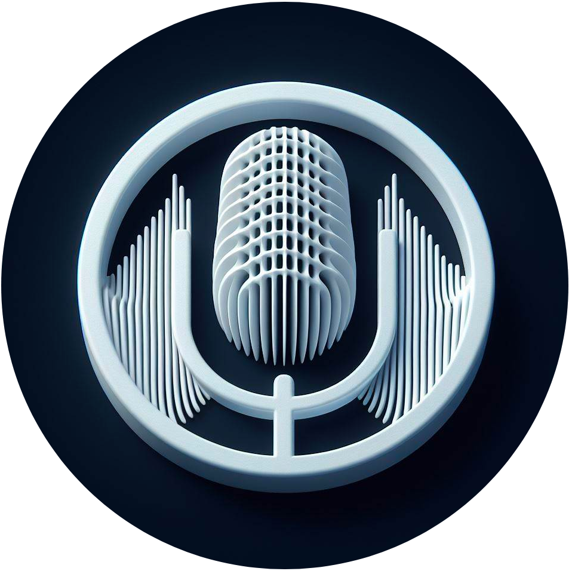

<h1 align="center">Awesome Audio / Speech </h1>

Awesome list about audio, speech and DSP(Digital signal processing)

## Contents

- [Recognition](#recognition)
- [Filtering / Denoising](#filtering--denoising)
- [Diarization](#diarization)
- [Synthesis](#synthesis)
- [Open source projects](#open-source-projects)
- [Research papers](#research-papers)
- [Blog posts](#blog-posts)
- [Books](#books)

## Recognition

- [Deep Speech (Baidu Research)](https://arxiv.org/abs/1412.5567)
- [Deep Speech 2 (Baidu Research)](https://arxiv.org/abs/1512.02595)
- [Google Speech-to-Text](https://cloud.google.com/speech-to-text)
- [Amazon Transcribe](https://aws.amazon.com/transcribe/)
- [PocketSphinx (CMU Sphinx)](https://cmusphinx.github.io/)
- [SpeechKit (Yandex)](https://cloud.yandex.com/en-ru/services/speechkit)
- [DeepSpeech (Mozilla)](https://github.com/mozilla/DeepSpeech)
- [Wav2Letter (Facebook AI)](https://github.com/facebookresearch/wav2letter)
- [ESPnet: End-to-End Speech Processing Toolkit](https://github.com/espnet/espnet)
- [Kaldi Speech Recognition Toolkit](https://github.com/kaldi-asr/kaldi)
- [Transformer-based Acoustic Modeling for Hybrid Speech Recognition](https://arxiv.org/abs/1910.09799)
- [Whisper](https://cdn.openai.com/papers/whisper.pdf) - OpenAI's robust speech recognition system.
- [Whisper X](https://github.com/m-bain/whisperX) - An extension of OpenAI's Whisper.
- [Faster Whisper](https://github.com/guillaumekln/faster-whisper) - An optimized implementation for faster processing.
- [DistilWhisper](https://github.com/huggingface/distil-whisper) - Hugging Face's distilled version of Whisper.

## Filtering / Denoising

- [Fast Fourier Transform (FFT)](https://en.wikipedia.org/wiki/Fast_Fourier_transform)
- [Short-Time Fourier Transform (STFT)](https://en.wikipedia.org/wiki/Short-time_Fourier_transform)
- [Adaptive filtering](https://en.wikipedia.org/wiki/Adaptive_filter)
- [Least Mean Squares (LMS) algorithm](https://en.wikipedia.org/wiki/Least_mean_squares_filter)
- [Kalman filter](https://en.wikipedia.org/wiki/Kalman_filter)
- [Wiener filter](https://en.wikipedia.org/wiki/Wiener_filter)
- [Spectral subtraction](https://github.com/shun60s/spectral-subtraction)
- [Blind source separation (BSS)](https://en.wikipedia.org/wiki/Signal_separation)
- [Non-negative matrix factorization (NMF)](https://en.wikipedia.org/wiki/Non-negative_matrix_factorization)
- [Infinite Impulse Response (IIR) filter](https://en.wikipedia.org/wiki/Infinite_impulse_response)
- [Finite Impulse Response (FIR) filter](https://en.wikipedia.org/wiki/Finite_impulse_response)

## Diarization

- [Speaker Diarization with LSTM](https://arxiv.org/pdf/1710.10468.pdf) - A paper on using LSTM networks for speaker diarization.
- [Fully Supervised Speaker Diarization](https://arxiv.org/pdf/1810.04719.pdf) - A novel approach to speaker diarization using fully supervised learning.
- [NVIDIA's Speaker Diarization](https://arxiv.org/pdf/2203.15974.pdf) - NVIDIA's advanced approach to speaker diarization.

## Synthesis

- [Tacotron (Google)](https://arxiv.org/abs/1703.10135)
- [Tacotron 2 (Google)](https://arxiv.org/abs/1712.05884)
- [DeepVoice (Baidu Research)](https://arxiv.org/abs/1702.07825)
- [DeepVoice 2 (Baidu Research)](https://arxiv.org/abs/1705.08947)
- [DeepVoice 3 (Baidu Research)](https://arxiv.org/abs/1710.07654)
- [VoiceLoop (Lyrebird AI)](https://github.com/facebookresearch/loop)
- [WaveNet (DeepMind)](https://arxiv.org/abs/1609.03499)
- [ClariNet (MIT)](https://openreview.net/forum?id=HklY120cYm)
- [SampleRNN (University of Montreal)](https://arxiv.org/abs/1612.07837)
- [MelNet (OpenAI)](https://arxiv.org/abs/1906.01083)
- [FastSpeech (AI Speech Lab, ByteDance)](https://arxiv.org/abs/1905.09263)
- [Transformer-TTS (IBM Research)](https://github.com/espnet/espnet)

## Open source projects

- [SoX](https://github.com/soxhub/sox) -  A cross-platform audio processing tool that provides a command-line interface for converting, editing, and playing audio files. 
- [librosa](https://github.com/librosa/librosa) - A library for audio and music analysis in Python, providing functions for computing features, such as MFCCs, chroma, and beat-related features. 
- [Audacity](https://github.com/audacity/audacity) - A cross-platform audio editor and recorder that supports many formats and provides a user-friendly interface. 
- [PulseAudio](https://github.com/pulseaudio/pulseaudio) - A cross-platform sound server for Linux, Unix, and Windows systems that provides sound server functionality to other applications.
- [PyTorch Audio](https://github.com/pytorch/audio) -  A library that provides a PyTorch-based implementation of common audio functions, such as spectrogram computation, audio pre-processing, and spectrogram-based features.
- [DeepSpeech](https://github.com/mozilla/DeepSpeech) - A speech-to-text engine developed by Mozilla Research.

## Research papers

- [WaveNet: A Generative Model for Raw Audio](https://arxiv.org/abs/1609.03499)
- [ClariNet: Parallel Wave Generation in End-to-End Text-to-Speech](https://openreview.net/forum?id=HklY120cYm)
- [Universal Sound Separation](https://arxiv.org/abs/1905.03330)
- [Speech Recognition with Deep Recurrent Neural Networks](https://arxiv.org/abs/1303.5778)
- [SEGAN: Speech Enhancement Generative Adversarial Network](https://arxiv.org/abs/1703.09452)

## Blog posts

- [Introducing Whisper](https://openai.com/blog/whisper/)
- [Tacotron 2: Generating Human-like Speech from Text](https://ai.googleblog.com/2017/12/tacotron-2-generating-human-like-speech.html)
- [WaveNet: A generative model for raw audio](https://www.deepmind.com/blog/wavenet-a-generative-model-for-raw-audio)
- [Looking to Listen: Audio-Visual Speech Separation](https://ai.googleblog.com/2018/04/looking-to-listen-audio-visual-speech.html)
- [Practical Deep Learning Audio Denoising](https://sthalles.github.io/practical-deep-learning-audio-denoising/)

## Books

- [Digital Signal Processing: Principles, Algorithms, and Applications by John G. Proakis and Dimitris K Manolakis](https://www.amazon.com/Digital-Signal-Processing-Principles-Applications/dp/0133737624).
- [Signals and Systems by Alan V. Oppenheim and Alan S. Willsky](https://www.amazon.com/Signals-Systems-2nd-Alan-Oppenheim/dp/0138147574).
- [The Scientist and Engineer's Guide to Digital Signal Processing by Steven W. Smith](https://www.amazon.com/Scientist-Engineers-Digital-Signal-Processing/dp/0966017633).
- [Discrete-Time Signal Processing by Alan V. Oppenheim and Ronald W. Schafer](https://www.amazon.com/Discrete-Time-Signal-Processing-3rd-Prentice-Hall/dp/0131988425).
- [DSP First: A Multimedia Approach by James H. McClellan and Ronald W. Schafer](https://www.amazon.com/DSP-First-Multimedia-James-McClellan/dp/0132431718).
- [Adaptive Filter Theory by Simon Haykin](https://www.amazon.com/Adaptive-Filter-Theory-Simon-Haykin/dp/013267145X).
